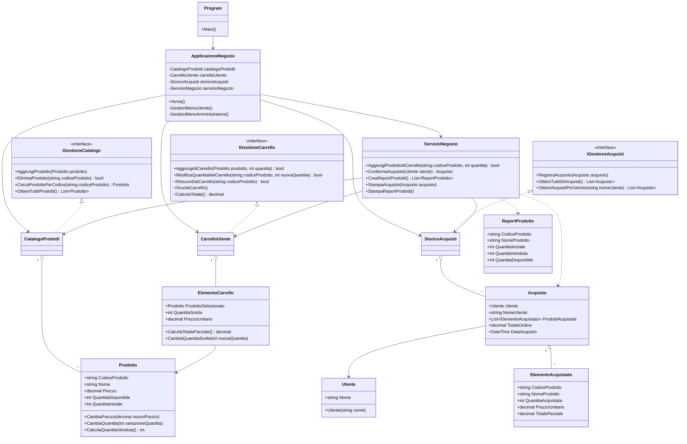

# Template Esame C# - Negozio online

Questo template contiene una Console App C# in un solo file: `Program.cs`.
Non usa namespace e non divide il codice in moduli, così rispetta il vincolo della traccia.
Il file `TestNegozioOnline.cs` è separato dal programma principale e contiene test manuali senza framework esterni.

## Struttura

- `Program`: punto di ingresso dell'applicazione.
- `ApplicazioneNegozio`: gestisce i menu console per utente e amministratore.
- `Utente`: classe madre per rappresentare un utente del sistema.
- `Prodotto`: classe madre per rappresentare un prodotto del catalogo con codice, nome, prezzo, quantità iniziale e quantità disponibile.
- `ElementoCarrello`: rappresenta una riga del carrello con prodotto, quantità scelta e prezzo unitario.
- `Acquisto` ed `ElementoAcquistato`: rappresentano un ordine completato e i prodotti acquistati.
- `CatalogoProdotti`: gestisce prodotti, prezzi e quantità di magazzino.
- `CarrelloUtente`: gestisce aggiunta, modifica, rimozione e totale del carrello.
- `StoricoAcquisti`: conserva in memoria gli acquisti effettuati durante l'esecuzione.
- `ServizioNegozio`: coordina catalogo, carrello e storico, soprattutto nella conferma dell'acquisto.
- `ReportProdotto`: modello semplice per il riepilogo amministratore.

## UML del template

Il template introduce `Utente` come classe madre. Gli studenti possono estenderla creando
classi figlie, per esempio per distinguere clienti e amministratori, senza cambiare i
contratti già presenti. Gli acquisti sono associati a un `Utente`, mentre il filtro dello
storico continua a usare il nome utente come richiesto dalla traccia.



## Cosa è già implementato

Sono già pronti alcuni metodi di base e i metodi di visualizzazione, così lo studente può
concentrarsi sulle operazioni richieste dalla traccia:

- caricamento dei prodotti iniziali;
- classe madre `Utente`, estendibile con classi figlie;
- ricerca prodotto per codice;
- protezione da codici prodotto duplicati;
- calcolo totale carrello;
- svuotamento carrello;
- cambio prezzo con validazione;
- cambio quantità magazzino senza andare sotto zero;
- visualizzazione catalogo;
- visualizzazione carrello;
- visualizzazione storico acquisti di un utente;
- stampa dettaglio acquisto;
- stampa report quantità iniziale, venduta e disponibile.

## Cosa deve essere completato

I metodi con `TODO` devono essere completati senza cambiare firma, nome, parametri o tipo di ritorno.
Le parti principali da implementare sono:

- ciclo principale della Console App;
- menu utente;
- menu amministratore;
- input da console;
- aggiunta/modifica/rimozione prodotti dal carrello;
- modifica/eliminazione prodotti nel catalogo;
- filtro acquisti per nome utente;
- aggiunta prodotto al carrello tramite codice;
- conferma acquisto di un `Utente` con controllo disponibilità, aggiornamento magazzino, storico e svuotamento carrello.

Non è richiesto il salvataggio su file o database: i dati possono restare in memoria durante l'esecuzione.

## Come eseguire i test

Per eseguire i test, chiamare temporaneamente `TestNegozioOnline.EseguiTuttiITest()` dentro `Main` al posto di `applicazione.Avvia()`.

Esempio:

```csharp
public static void Main()
{
    TestNegozioOnline.EseguiTuttiITest();
}
```

Poi eseguire dalla cartella del template:

```bash
dotnet run --project NegozioOnlineTemplate.csproj
```

Se compare l'errore `The name 'TestNegozioOnline' does not exist in the current context`, significa che `TestNegozioOnline.cs` non è nello stesso progetto di `Program.cs`.
Controllare che entrambi i file siano nella stessa cartella del file `NegozioOnlineTemplate.csproj`, oppure aggiungere manualmente `TestNegozioOnline.cs` al progetto dall'IDE.

I test stampano `[PASS]`, `[FAIL]` oppure `[FAIL - TODO]`. I `FAIL - TODO` indicano i metodi ancora lasciati vuoti nel template.


## Comandi utili: 

# git

```bash 
git add .
git commit -m "messaggio"
git push origin
```

# dotnet 
```bash 
dotnet build 
```

```bash
dotnet run
```
o

```bash
dotnet run --project NegozioOnlineTemplate.csproj]
```

# cmd: 

Per impostare il terminale nella cartella del progetto

```bash 
cd [percorso_progetto]
```

## Consigli: 

- eseguire i test
- leggere con attenzione il risultato dei test 
- leggere con attenzione l'output che mostra eventuali errori (distinguando tra errori a Compile Time (errori di sintassi) ed errori a Run Time (metodi/funzioni che non fanno quello che dovrebbero fare)) e guardare il numero della riga in cui è presente l'errore
- git è opzionale
